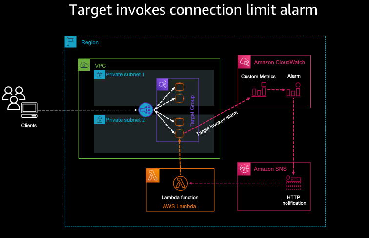
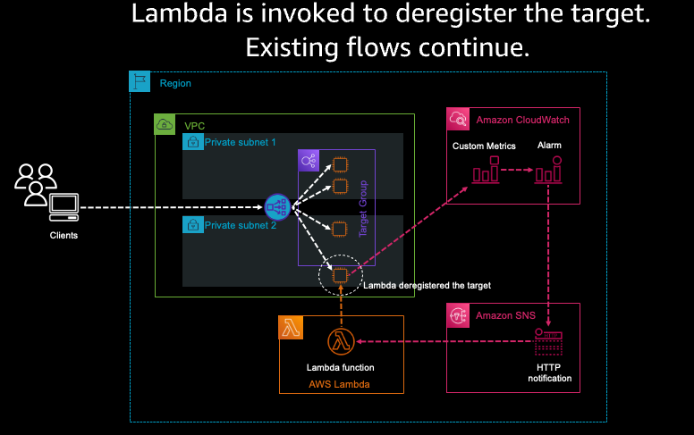

## Scaling NLB Target Groups by Connections

When workload performance depends on the number of networking connections, traditional load balancing metrics like CPU load or memory utilization do not provide the information you need in order to make scaling decisions. In this post, we explore a solution that automatically scales backend connections of a Network Load Balancer (NLB) target group based on a fixed number of network connections. To do this, we create a custom Amazon CloudWatch metric and use it to monitor and scale target groups. This solution uses Amazon CloudWatch, AWS Lambda, and Amazon Simple Notification Service (Amazon SNS) to automate NLB target scaling.

## Solution overview
Our example application, shown in figure 1, is hosted within a VPC, behind an NLB that forwards traffic
to a Target Group. There are multiple targets (instances) in the Target Group that send connection
metrics to CloudWatch Custom Metrics. Our first step to create a CloudWatch alarm by creating a
custom metric. Then, that alarm sends the notification to an Amazon SNS topic. After that, Amazon SNS
invokes a Lambda function that deregisters or registers a target in the Target Group according to the
payload information provided by Amazon SNS

As described previously, our connection-based scaling method is based on a custom CloudWatch metric.
The following example shows how to set up a sample custom CloudWatch metric from your application
server on Amazon Elastic Compute Cloud (Amazon EC2) as part of a Target Group and NLB

### Cloudformation Template
Cloudformation template is provided under \cloudformation_templates\CF-NLB-TG-scaling.yaml
Simply create the AWS components of this solution by importing the cloudformation template into your account.

### Python Script for Lambda function
The python script for Lambda function is stored at \lambda_scripts\lambda.py

## Security

See [CONTRIBUTING](CONTRIBUTING.md#security-issue-notifications) for more information.

## License

This library is licensed under the MIT-0 License. See the LICENSE file.

